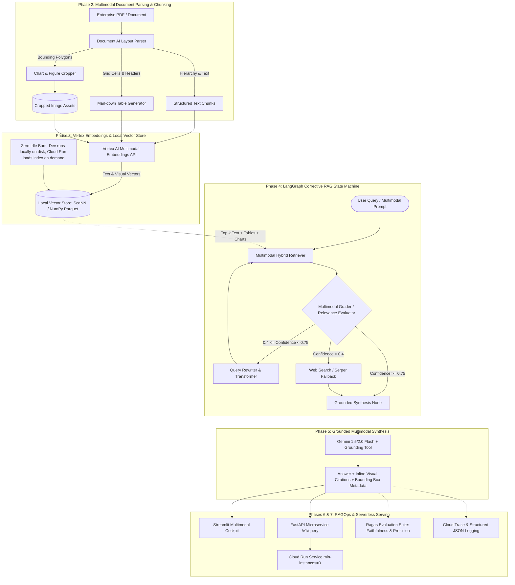

# Enterprise Corrective Multimodal RAGOps Platform (GCP)
## Master Architecture, Execution Roadmap & Budget Guardrails

---

## Executive Summary & System Architecture

The **Enterprise Corrective Multimodal RAGOps Platform** is an enterprise-grade document intelligence and retrieval-augmented generation engine engineered specifically on Google Cloud Platform. It ingests complex, multi-modal enterprise documents (financial reports, technical manuals, contracts, clinical papers) featuring dense text, complex multi-column layouts, financial tables, and embedded figures/charts.

By combining **Google Cloud Document AI**, **Vertex AI Multimodal Embeddings (`multimodalembedding@001`)**, **LangGraph Corrective RAG (CRAG)**, **Gemini 1.5 / 2.0 Flash Grounding**, and **Ragas Multimodal Evaluation**, the platform guarantees grounded, verifiable answers with visual citations while strictly abiding by a **zero-idle-burn serverless cost model**.

### Architecture Diagram



---

## Component & API Stack

| Component | Technology / Service | Model / API Specification | Purpose & Zero-Burn Strategy |
| :--- | :--- | :--- | :--- |
| **Document Parsing** | GCP Document AI | Layout Parser / Form Parser (`projects/{id}/locations/{loc}/processors/{id}`) | High-accuracy layout hierarchy, table extraction, and image bounding box detection. Pay per page processed. |
| **Multimodal Embeddings** | Vertex AI Embeddings | `multimodalembedding@001` (1408 dimensions) | Joint vector space for text blocks, Markdown tables, and cropped chart PNGs. Pay per prediction call. |
| **Vector Store** | Local ScaNN / NumPy Cosine | Persistent Parquet / Annoy / NumPy Cosine Index | **$0.00 idle cost**. Prevents continuous Vertex AI Vector Search endpoint billing (~$150-$300/month per node). |
| **Agent Orchestrator** | LangGraph / LangChain Core | StateGraph with Typed State & Conditional Routing | Corrective RAG (CRAG) cyclical workflow: retrieve -> grade -> rewrite/search -> synthesize. |
| **LLM & Grounding** | Vertex AI Gemini | `gemini-1.5-flash-002` / `gemini-2.0-flash` | Ultra-fast multimodal generation, structured output extraction, and grounded visual citations. |
| **Web Search Fallback** | Google Search Grounding / Serper API | Vertex Google Search Grounding or Serper API | Corrective fallback when internal enterprise corpus lacks sufficient context. |
| **Evaluation Suite** | Ragas + Pytest | Faithfulness, Answer Relevance, Context Precision | Automated CI/CD regression testing to benchmark retrieval and hallucination rates. |
| **Serving Layer** | FastAPI + Uvicorn | Python 3.11+ async REST API | Endpoints for `/v1/query`, `/v1/ingest`, `/v1/eval`, `/v1/health`. |
| **UI Dashboard** | Streamlit | Streamlit Multimodal UI | Interactive document inspector, bounding box overlay, CRAG state debugger, and visual citations. |
| **Deployment Target** | GCP Cloud Run | Docker container, `--min-instances 0`, `--max-instances 5` | Scale-to-zero compute. Only billed while processing queries. Idle cost = $0.00. |

---

## Cost Governance & Budget Guardrails ($300 Credit Limit)

To strictly prevent credit exhaustion, the platform enforces the following hard constraints:

1. **Zero Idle Burn Architecture**:
   - Cloud Run is configured with `--min-instances 0`. No CPU/memory allocation occurs without active incoming requests.
   - Vector Search is served via local file-backed ScaNN/NumPy indexes during development and testing. **Vertex AI Vector Search Index Endpoints must NEVER be deployed as standing 24/7 instances.**
2. **GCP Budget Alerts**:
   - Programmatic thresholds set at $50 (warning), $150 (review), and $250 (critical halt).
3. **Session Shutdown Protocols**:
   - Mandatory verification checks at the end of Day 1 and Day 2 to guarantee no background VMs, unattached persistent disks, or running endpoints remain active.

---

## Two-Day Interactive Implementation Roadmap

### DAY 1: Core Multimodal Processing, Ingestion & CRAG State Machine

- [ ] **Phase 1: Environment Setup, GCP Provisioning & Configuration Schemas**
  - [ ] Inspect and configure Google Cloud CLI (`gcloud`) authentication and project parameters.
  - [x] Initialize Git repository structure, pre-commit hooks, and `.gitignore`.
  - [x] Implement `src/config/settings.py` using `pydantic-settings` to validate GCP project ID, storage buckets, processor IDs, model names, and budget thresholds.
  - [x] Create `scripts/gcp_bootstrap.ps1` and `scripts/gcp_bootstrap.sh` to enable required GCP APIs (`documentai.googleapis.com`, `aiplatform.googleapis.com`, `run.googleapis.com`, `storage.googleapis.com`).
  - [x] Implement unit tests in `tests/unit/test_settings.py` to verify configuration loading and environment validation.

- [x] **Phase 2: Document AI Layout Parsing, Table Markdown & Chart Cropping**
  - [x] Implement `src/ingestion/docai_parser.py`: Client for Document AI Layout Parser handling PDF bytes, pagination, and tokenization.
  - [x] Implement `src/ingestion/table_extractor.py`: Converts Document AI table layout structures (cells, row/column spans) into standardized Markdown tables.
  - [x] Implement `src/ingestion/chart_cropper.py`: Utilizes PIL/Pillow and normalized bounding polygons to extract and persist charts, figures, and diagrams as clean PNGs with metadata.
  - [x] Implement `src/ingestion/pipeline.py`: Ingestion coordinator that saves structured chunks (text, table markdown, image references) into JSONL/Parquet.
  - [x] Implement unit tests in `tests/unit/test_docai_parser.py` with mock Document AI payloads.

- [x] **Phase 3: Vertex AI Multimodal Embeddings & Zero-Idle-Burn Vector Store**
  - [x] Implement `src/vector_store/embeddings.py`: Wraps Vertex AI `multimodalembedding@001` to generate normalized 1408-dim embeddings for text and images.
  - [x] Implement `src/vector_store/base.py`: Abstract VectorStore interface for vector indexing, metadata filtering, and similarity search.
  - [x] Implement `src/vector_store/local_store.py`: File-backed vector store using NumPy cosine similarity / ScaNN with Parquet metadata persistence.
  - [x] Implement automated chunk indexing script to ingest sample multimodal PDF documents into the local index.
  - [x] Implement unit tests in `tests/unit/test_embeddings.py` and `tests/unit/test_local_store.py`.

- [ ] **Phase 4: LangGraph Corrective RAG (CRAG) Orchestration & State Machine**
  - [ ] Implement `src/crag/state.py`: Define `CRAGState` (TypedDict) with keys for `query`, `retrieved_docs`, `extracted_images`, `relevance_scores`, `transformed_query`, `web_search_results`, and `final_response`.
  - [ ] Implement `src/crag/nodes/retriever.py`: Hybrid multimodal retriever querying text and visual embeddings.
  - [ ] Implement `src/crag/nodes/grader.py`: Evaluator agent using Gemini Flash structured outputs to classify document relevance as `RELEVANT`, `PARTIALLY_RELEVANT`, or `NOT_RELEVANT`.
  - [ ] Implement `src/crag/nodes/rewriter.py`: Query reformulation node optimizing keywords for secondary retrieval.
  - [ ] Implement `src/crag/nodes/fallback.py`: Web search fallback node when local documents do not satisfy confidence thresholds.
  - [ ] Implement `src/crag/edges.py`: Conditional routing logic based on grading outcomes.
  - [ ] Compile complete `src/crag/graph.py` StateGraph and export the visual execution graph.
  - [ ] Implement unit tests in `tests/unit/test_crag_nodes.py` to verify state transitions.
  - [ ] **Day 1 Shutdown Verification**: Run cost-guard checklist ensuring $0 running resources.

---

### DAY 2: Grounded Synthesis, RAGOps CI/CD Benchmarking & Cloud Run Deployment

- [ ] **Phase 5: Grounded Multimodal Synthesis with Gemini & Visual Citations**
  - [ ] Implement `src/crag/nodes/generator.py`: Grounded generator node passing filtered text, markdown tables, and cropped image PIL objects to Gemini 1.5/2.0 Flash.
  - [ ] Build citation parser extracting exact page numbers, table references, and image crop paths into structured response metadata.
  - [ ] Add strict hallucination guardrails: if grounded facts cannot verify claims, explicitly declare corpus insufficiency.
  - [ ] Implement unit tests in `tests/unit/test_generator.py`.

- [ ] **Phase 6: RAGOps CI/CD Benchmarking Harness (Ragas Evals & Latency Tracing)**
  - [ ] Implement `src/evals/ragas_eval.py`: Ragas evaluation pipeline computing Faithfulness, Answer Relevance, and Context Precision over a synthetic/golden benchmark dataset.
  - [ ] Implement `src/evals/latency_tracer.py`: Step-by-step latency, token consumption, and cost tracking across every CRAG node.
  - [ ] Implement `src/evals/benchmark_runner.py`: CLI runner generating evaluation summary reports in Markdown and JSON.
  - [ ] Integrate automated evaluation gate into `tests/integration/test_evals.py` (fails if Faithfulness < 0.85).

- [ ] **Phase 7: Streamlit Dashboard, FastAPI Service & Scale-to-Zero Cloud Run Deployment**
  - [ ] Implement `src/api/schemas.py`: Pydantic input/output schemas for API requests.
  - [ ] Implement `src/api/routes.py`: Endpoints for `/v1/query`, `/v1/ingest`, `/v1/eval`, `/v1/health`.
  - [ ] Implement `src/api/app.py`: FastAPI production app with CORS and structured request logging.
  - [ ] Implement `src/ui/app.py`: Streamlit cockpit featuring PDF upload, side-by-side bounding box visualizer, CRAG execution timeline, and citation rendering.
  - [ ] Build multi-stage production `Dockerfile` with slim Python base.
  - [ ] Deploy to GCP Cloud Run using `--min-instances 0 --max-instances 5 --memory 2Gi --cpu 2`.
  - [ ] Verify scale-to-zero behavior: monitor instances dropping to 0 after request completion.
  - [ ] **Day 2 Shutdown Verification**: Final cost audit and resource verification.

---

## Detailed Phase Specifications

### Phase 1: Environment, Provisioning & Configuration
- **Files**:
  - `src/config/settings.py`
  - `src/config/logging_config.py`
  - `scripts/gcp_bootstrap.ps1`, `scripts/gcp_bootstrap.sh`
  - `.env.example`, `.gitignore`, `pyproject.toml`
  - `tests/unit/test_settings.py`
- **Inputs/Outputs**:
  - Input: Environment variables (`GCP_PROJECT_ID`, `GCP_REGION`, `DOCUMENT_AI_PROCESSOR_ID`).
  - Output: Validated `Settings` singleton, active GCP APIs.
- **Verification Command**:
  ```powershell
  pytest tests/unit/test_settings.py -v
  ```

### Phase 2: Document AI Parsing, Table Markdown & Chart Cropping
- **Files**:
  - `src/ingestion/docai_parser.py`
  - `src/ingestion/table_extractor.py`
  - `src/ingestion/chart_cropper.py`
  - `src/ingestion/pipeline.py`
  - `tests/unit/test_docai_parser.py`
- **Inputs/Outputs**:
  - Input: Raw PDF documents from `data/raw/`.
  - Output: Extracted text blocks, Markdown tables, cropped image PNGs saved to `data/processed/`.
- **Verification Command**:
  ```powershell
  pytest tests/unit/test_docai_parser.py -v
  ```

### Phase 3: Vertex Multimodal Embeddings & Local Vector Store
- **Files**:
  - `src/vector_store/base.py`
  - `src/vector_store/embeddings.py`
  - `src/vector_store/local_store.py`
  - `tests/unit/test_embeddings.py`
  - `tests/unit/test_local_store.py`
- **Inputs/Outputs**:
  - Input: Processed text blocks, tables, and cropped images from `data/processed/`.
  - Output: Indexed vector files (`data/vector_index/index.parquet` & embeddings matrix).
- **Verification Command**:
  ```powershell
  pytest tests/unit/test_embeddings.py tests/unit/test_local_store.py -v
  ```

### Phase 4: LangGraph Corrective RAG Orchestration
- **Files**:
  - `src/crag/state.py`
  - `src/crag/nodes/retriever.py`
  - `src/crag/nodes/grader.py`
  - `src/crag/nodes/rewriter.py`
  - `src/crag/nodes/fallback.py`
  - `src/crag/edges.py`
  - `src/crag/graph.py`
  - `tests/unit/test_crag_nodes.py`
- **Inputs/Outputs**:
  - Input: Query string and retrieved candidate multimodal chunks.
  - Output: Corrected document set and execution path trace.
- **Verification Command**:
  ```powershell
  pytest tests/unit/test_crag_nodes.py -v
  ```

### Phase 5: Grounded Synthesis with Gemini
- **Files**:
  - `src/crag/nodes/generator.py`
  - `tests/unit/test_generator.py`
- **Inputs/Outputs**:
  - Input: Verified multimodal chunks + original query.
  - Output: Grounded natural language response with visual citations and page references.
- **Verification Command**:
  ```powershell
  pytest tests/unit/test_generator.py -v
  ```

### Phase 6: RAGOps CI/CD Benchmarking Harness
- **Files**:
  - `src/evals/ragas_eval.py`
  - `src/evals/latency_tracer.py`
  - `src/evals/benchmark_runner.py`
  - `tests/integration/test_evals.py`
- **Inputs/Outputs**:
  - Input: Test dataset (`eval_dataset.jsonl`).
  - Output: Evaluation report markdown (`eval_report.md`) with Ragas metrics.
- **Verification Command**:
  ```powershell
  pytest tests/integration/test_evals.py -v
  ```

### Phase 7: UI Dashboard, API & Scale-to-Zero Cloud Run
- **Files**:
  - `src/api/schemas.py`, `src/api/routes.py`, `src/api/app.py`
  - `src/ui/app.py`
  - `Dockerfile`, `docker-compose.yml`
  - `scripts/deploy_cloud_run.ps1`, `scripts/deploy_cloud_run.sh`
- **Inputs/Outputs**:
  - Input: Containerized FastAPI & Streamlit applications.
  - Output: Live HTTPS Cloud Run endpoint (`min-instances=0`).
- **Verification Command**:
  ```powershell
  pytest tests/unit/test_api.py -v
  ```

---

## Cost-Guard Shutdown Protocols

### Day 1 Shutdown Checklist
1. Ensure no Vertex AI Vector Search Index Endpoints are deployed:
   ```bash
   gcloud ai index-endpoints list --region=<GCP_REGION>
   ```
2. Verify all local artifacts are saved in `data/` and no background compute tasks are running.
3. Check GCP billing dashboard to ensure burn is under $5.

### Day 2 Shutdown Checklist
1. Verify Cloud Run `--min-instances` is set to `0`:
   ```bash
   gcloud run services describe multimodal-crag-api --region=<GCP_REGION> --format="value(spec.template.metadata.annotations['autoscaling.knative.dev/minScale'])"
   ```
2. Delete any temporary staging GCS buckets or test artifacts if no longer required.
3. Record final billing summary against the $300 budget ceiling.
