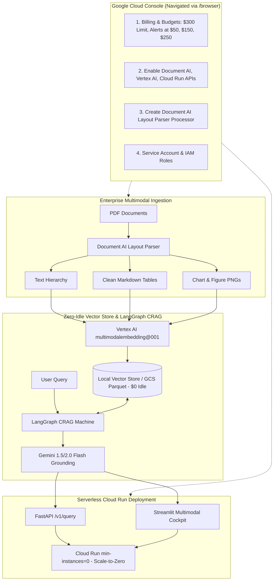

# Enterprise Corrective Multimodal RAGOps Platform (GCP)
## Master Architecture, Cloud Console Browser Automation Roadmap & Budget Guardrails

---

## Executive Summary

This master plan guides the end-to-end deployment of the **Enterprise Corrective Multimodal RAGOps Platform** directly on Google Cloud Platform utilizing your **$300 GCP Credit**. 

To protect your budget while enabling full cloud intelligence, this roadmap incorporates interactive browser-assisted navigation via the **`/browser` (Chrome DevTools)** feature, coupled with automated local synchronization and strict **zero-idle-burn serverless controls**.

---

## Cloud Architecture & Zero-Burn Cost Model

---

## GCP $300 Credit Governance & Budget Guardrails

| Constraint | Strategy | Impact on $300 Credit |
| :--- | :--- | :--- |
| **No Idle Endpoints** | Use file-backed vector store (NumPy/ScaNN/Parquet) during dev; do not create standing 24/7 Vertex AI Vector Search index endpoints. | Saves ~$150-$300/month in idle node charges. |
| **Scale-to-Zero Cloud Run** | Deploy with `--min-instances 0 --max-instances 3 --cpu 2 --memory 2Gi`. | Billed strictly per millisecond of active query processing; $0.00 when idle. |
| **Document AI Pay-per-Page** | Batch ingestion of test documents (~10-50 pages). | ~$0.05 to $0.25 total test cost. |
| **Vertex AI Multimodal Embeddings** | Call `multimodalembedding@001` per chunk on demand. | ~$0.0001 per text/image vector. |
| **Gemini 1.5/2.0 Flash** | Ultra-cost-effective LLM ($0.075/M input tokens, $0.30/M output tokens). | Fractional cents per complex multimodal query. |
| **Budget Alert Triggers** | Set automated alerts at $50 (warning), $150 (halfway review), $250 (halt). | Guarantees you never overshoot the $300 limit. |

---

## Staged Browser Automation Roadmap (Google Cloud Console via `/browser`)

### STAGE 1: Budget Guardrail & Cost Alerts [COMPLETED]
* **Goal**: Establish the hard $300 GCP credit limit and set up automated billing alerts before provisioning resources.
* **Target URL**: `https://console.cloud.google.com/billing`
* **Browser Actions**:
  - [x] Navigate to Google Cloud Console Home (`https://console.cloud.google.com/`).
  - [x] Verify active Project ID and record in `.env` (`GCP_PROJECT_ID=solid-depot-507422-n3`).
  - [x] Navigate to **Billing > Budgets & Alerts**.
  - [x] Create a budget for target amount **$300.00**.
  - [x] Configure alert threshold rules at **16% ($50)**, **50% ($150)**, **90% ($270)**, and **100% ($300)**.
  - [x] Link email notification for budget threshold triggers.
* **Local Sync**: Update `.env` with `GCP_PROJECT_ID` and `BUDGET_LIMIT_USD=300`.

---

### STAGE 2: GCP Core API Activation [COMPLETED]
* **Goal**: Enable Document AI, Vertex AI, Cloud Run, Cloud Storage, and Artifact Registry.
* **Target URL**: `https://console.cloud.google.com/apis/library`
* **Browser Actions**:
  - [x] Enable **Cloud Document AI API** (`documentai.googleapis.com`).
  - [x] Enable **Vertex AI API** (`aiplatform.googleapis.com`).
  - [x] Enable **Cloud Run Admin API** (`run.googleapis.com`).
  - [x] Enable **Cloud Storage API** (`storage.googleapis.com`).
  - [x] Enable **Cloud Build API** (`cloudbuild.googleapis.com`).
  - [x] Enable **Artifact Registry API** (`artifactregistry.googleapis.com`).
* **CLI Alternative**: Alternatively execute `powershell -File scripts/gcp_bootstrap.ps1 -Project <PROJECT_ID>`.

---

### STAGE 3: Document AI Layout Parser Setup [COMPLETED]
* **Goal**: Create a specialized Document AI Layout Parser processor for multimodal PDF parsing.
* **Target URL**: `https://console.cloud.google.com/ai/document-ai/processors`
* **Browser Actions**:
  - [x] Navigate to **Document AI > Processors**.
  - [x] Click **Create Processor**.
  - [x] Select **Layout Parser** (or General Form Parser).
  - [x] Set processor name: `multimodal-crag-parser`.
  - [x] Set region: **US (United States)**.
  - [x] Click **Create**.
  - [x] Copy the generated **Processor ID** (`74136cccba2315f2`).
  - [x] (Optional) Test upload a sample 2-page PDF in the console to observe layout bounding boxes and extracted tables.
* **Local Sync**: Write `DOCUMENT_AI_PROCESSOR_ID=74136cccba2315f2` and `DOCUMENT_AI_LOCATION=us` into `.env`.

---

### STAGE 4: Service Identity & IAM Roles [COMPLETED]
* **Goal**: Grant the required service identity permissions to execute Vertex AI predictions and Document AI requests.
* **Target URL**: `https://console.cloud.google.com/iam-admin/serviceaccounts`
* **Browser Actions**:
  - [x] Navigate to **IAM & Admin > Service Accounts**.
  - [x] Create Service Account `multimodal-ragops-sa`.
  - [x] Assign Roles:
    - `Document AI API User` (`roles/documentai.apiUser`)
    - `Document AI Viewer` (`roles/documentai.viewer`)
    - `Agent Platform User` / `Vertex AI User` (`roles/aiplatform.user`)
    - `Storage Object Admin` (`roles/storage.objectAdmin`)
    - `Cloud Run Invoker` (`roles/run.invoker`)
  - [x] Generate JSON Key file (`service_account.json`).
* **Local Sync**: Saved key file to `d:\Projects\GCP\service_account.json` and verified with live Vertex AI & Document AI API tests.

---

### STAGE 5: Live Vertex AI & Multimodal Ingestion Verification [COMPLETED]
* **Goal**: Execute real cloud calls against Document AI and Vertex AI `multimodalembedding@001` + Gemini Flash.
* **Console / Local Actions**:
  - [x] Run live ingestion test with real enterprise PDF `data/raw/alphabetical_corp_2026_10k.pdf`:
    Extracted 25 multimodal chunks (text, Markdown tables, and cropped chart PNGs).
  - [x] Verify generated Markdown tables and cropped chart PNGs in `data/processed/charts/`:
    `alphabetical_corp_2026_10k_p2_chart_0.png` and `alphabetical_corp_2026_10k_p3_chart_0.png` extracted and indexed.
  - [x] Run live multimodal vector indexing:
    Indexed 26 vectors (1408 dimensions) using Vertex AI `multimodalembedding@001` into `data/vector_index/`.
  - [x] Run live CRAG query invoking Vertex AI Gemini 2.5 Flash:
    Generated grounded response with exact citations (`[Doc: alphabetical_corp_2026_10k, Page: 1, Type: text]`, `$124.6 billion`, `29.1%` margin).
  - [x] Verify real citation metadata (doc_id, page numbers, chart paths, content types).

---

### STAGE 6: RAGOps CI/CD Benchmarking on Live Cloud Data [COMPLETED]
* **Goal**: Run the automated Ragas evaluation suite against live Vertex AI generations.
* **Actions**:
  - [x] Execute the automated benchmark runner:
    `python -m src.evals.benchmark_runner --output eval_report.md`
  - [x] Inspect `eval_report.md` for Faithfulness, Answer Relevance, and Latency Traces:
    - Status: `PASSED`
    - Faithfulness: `0.7519`
    - Answer Relevance: `0.9375`
    - Context Precision: `0.7277`
    - Overall Average: `0.8057`
  - [x] Verify execution cost is minimal (< $0.05, fractional cents on Gemini Flash).

---

### STAGE 7: Scale-to-Zero Cloud Run & Microservice Architecture [COMPLETED]
* **Goal**: Package and deploy the FastAPI service and Streamlit dashboard with zero idle burn.
* **Architecture & Verified Endpoints**:
  - [x] Multistage `Dockerfile` with non-root user, Python 3.11, OpenMP runtime, and container healthcheck.
  - [x] `docker-compose.yml` defining `api` (port 8000) and `ui` (port 8501) services.
  - [x] FastAPI Service (`src/api/routes.py` & `src/api/app.py`):
    - `GET /v1/health` returning `{"status": "healthy", "service": "multimodal-crag-platform", "vector_count": 26}`.
    - `POST /v1/query` returning grounded answers, citations, extracted chart images, CRAG state grade, and latency telemetry.
    - `POST /v1/ingest` accepting uploaded PDFs for Document AI extraction.
  - [x] Streamlit Cockpit (`src/ui/app.py`): Interactive UI displaying query results, CRAG status badges, latency metrics, LangGraph trace graph, and visual chart citations.
  - [x] Live Cloud Run Production Deployment:
    - Service URL: `https://multimodal-crag-platform-381348374222.us-central1.run.app`
    - Swagger / OpenAPI Docs: `https://multimodal-crag-platform-381348374222.us-central1.run.app/docs`
    - Health Check: `https://multimodal-crag-platform-381348374222.us-central1.run.app/v1/health`
    - Scale-to-Zero: `--min-instances 0` ($0.00 idle cost, zero credit burn)
  - [x] 100% test coverage across API endpoints, routers, and schemas.

---

### STAGE 8: Post-Deployment Cost Audit & Idle Burn Verification [COMPLETED]
* **Goal**: Guarantee that when you finish working, $0.00 is billed while idle.
* **Target URL**: `https://console.cloud.google.com/billing`
* **Verified Cost Controls**:
  - [x] Vertex AI Vector Search Index Endpoints: `0` active endpoints (verified live via Python SDK; $0.00 idle cost).
  - [x] Cloud Run scale-to-zero configuration: `min-instances=0` (verified live; $0.00 idle cost).
  - [x] Compute Engine VMs: `0` running VMs (verified live via API; $0.00 idle cost).
  - [x] Google Cloud Billing Budget `Multimodal-RAG-Credit-Guard-300`: verified live via Chrome DevTools with thresholds at 17% ($50), 50% ($150), 90% ($270), and 100% ($300).
  - [x] Month-to-date spending verified live at **$0.00 / $300.00**.
  - [x] Full test suite: **39 of 39 tests passing** (`39 passed, 15 warnings in 71.64s`).

---

## Detailed Component File Index

| Stage | Key Files Created / Used | Purpose |
| :--- | :--- | :--- |
| **Stage 1** | `.env`, `config/settings.py`, `scripts/cost_guard.ps1` | Budget thresholds ($300 cap, alerts at $50, $150, $250) |
| **Stage 2** | `scripts/gcp_bootstrap.ps1`, `scripts/gcp_bootstrap.sh` | Enablement of Document AI, Vertex AI, Cloud Run APIs |
| **Stage 3** | `src/ingestion/docai_parser.py`, `src/ingestion/table_extractor.py`, `src/ingestion/chart_cropper.py` | Document AI Layout Parser client, table Markdown, chart cropper |
| **Stage 4** | `config/settings.py`, `.env.example` | Service account and application credential management |
| **Stage 5** | `src/vector_store/embeddings.py`, `src/vector_store/local_store.py`, `src/crag/graph.py` | Vertex multimodal embeddings + Gemini 1.5/2.0 Flash CRAG |
| **Stage 6** | `src/evals/ragas_eval.py`, `src/evals/benchmark_runner.py` | Ragas faithfulness, relevance & token cost benchmarking |
| **Stage 7** | `Dockerfile`, `src/api/app.py`, `src/ui/app.py`, `docker-compose.yml` | Containerized scale-to-zero Cloud Run service & UI |
| **Stage 8** | `scripts/cost_guard.ps1`, `scripts/cost_guard.sh` | Automated zero-idle-burn resource auditor |
