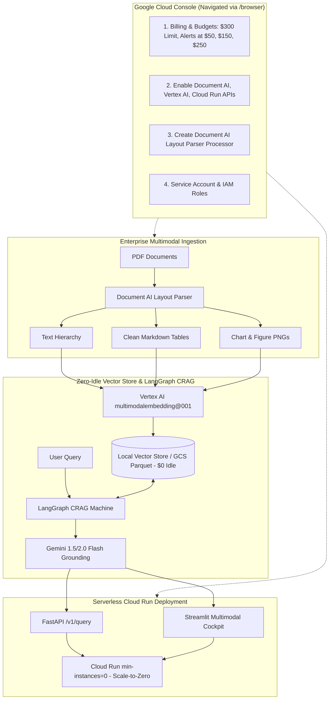

# Enterprise Corrective Multimodal RAGOps Platform (GCP)
## Master Architecture, Cloud Console Browser Automation Roadmap & Budget Guardrails

---

## Executive Summary

This master plan guides the end-to-end deployment of the **Enterprise Corrective Multimodal RAGOps Platform** directly on Google Cloud Platform utilizing your **$300 GCP Credit**. 

To protect your budget while enabling full cloud intelligence, this roadmap incorporates interactive browser-assisted navigation via the **`/browser` (Chrome DevTools)** feature, coupled with automated local synchronization and strict **zero-idle-burn serverless controls**.

---

## Cloud Architecture & Zero-Burn Cost Model



---

## GCP $300 Credit Governance & Budget Guardrails

| Constraint | Strategy | Impact on $300 Credit |
| :--- | :--- | :--- |
| **No Idle Endpoints** | Use file-backed vector store (NumPy/ScaNN/Parquet) during dev; do not create standing 24/7 Vertex AI Vector Search index endpoints. | Saves ~$150-$300/month in idle node charges. |
| **Scale-to-Zero Cloud Run** | Deploy with `--min-instances 0 --max-instances 3 --cpu 2 --memory 2Gi`. | Billed strictly per millisecond of active query processing; $0.00 when idle. |
| **Document AI Pay-per-Page** | Batch ingestion of test documents (~10-50 pages). | ~$0.05 to $0.25 total test cost. |
| **Vertex AI Multimodal Embeddings** | Call `multimodalembedding@001` per chunk on demand. | ~$0.0001 per text/image vector. |
| **Gemini 1.5/2.0 Flash** | Ultra-cost-effective LLM ($0.075/M input tokens, $0.30/M output tokens). | Fractional cents per complex multimodal query. |
| **Budget Alert Triggers** | Set automated alerts at $50 (warning), $150 (halfway review), $250 (halt). | Guarantees you never overshoot the $300 limit. |

---

## Staged Browser Automation Roadmap (Google Cloud Console via `/browser`)

### STAGE 1: Budget Protection & GCP Project Configuration
* **Goal**: Select active GCP project and configure early warning budget alerts for your $300 credit.
* **Target URL**: `https://console.cloud.google.com/billing/budgets`
* **Browser Actions**:
  - [ ] Navigate to Google Cloud Console Home (`https://console.cloud.google.com/`).
  - [ ] Verify active Project ID and record in `.env` (`GCP_PROJECT_ID=...`).
  - [ ] Navigate to **Billing > Budgets & Alerts**.
  - [ ] Create a budget for target amount **$300.00**.
  - [ ] Configure alert threshold rules at **15% ($50)**, **50% ($150)**, and **85% ($250)**.
  - [ ] Link email notification for budget threshold triggers.
* **Local Sync**: Update `.env` with `GCP_PROJECT_ID` and `BUDGET_LIMIT_USD=300`.

---

### STAGE 2: GCP Core API Activation
* **Goal**: Enable Document AI, Vertex AI, Cloud Run, Cloud Storage, and Artifact Registry.
* **Target URL**: `https://console.cloud.google.com/apis/library`
* **Browser Actions**:
  - [ ] Enable **Cloud Document AI API** (`documentai.googleapis.com`).
  - [ ] Enable **Vertex AI API** (`aiplatform.googleapis.com`).
  - [ ] Enable **Cloud Run Admin API** (`run.googleapis.com`).
  - [ ] Enable **Cloud Storage API** (`storage.googleapis.com`).
  - [ ] Enable **Cloud Build API** (`cloudbuild.googleapis.com`).
  - [ ] Enable **Artifact Registry API** (`artifactregistry.googleapis.com`).
* **CLI Alternative**: Alternatively execute `powershell -File scripts/gcp_bootstrap.ps1 -Project <PROJECT_ID>`.

---

### STAGE 3: Document AI Layout Parser Setup
* **Goal**: Create a specialized Document AI Layout Parser processor for multimodal PDF parsing.
* **Target URL**: `https://console.cloud.google.com/ai/document-ai/processors`
* **Browser Actions**:
  - [ ] Navigate to **Document AI > Processors**.
  - [ ] Click **Create Processor**.
  - [ ] Select **Layout Parser** (or General Form Parser).
  - [ ] Set processor name: `multimodal-crag-parser`.
  - [ ] Set region: **US (United States)**.
  - [ ] Click **Create**.
  - [ ] Copy the generated **Processor ID** (format: `16-character alphanumeric string`).
  - [ ] (Optional) Test upload a sample 2-page PDF in the console to observe layout bounding boxes and extracted tables.
* **Local Sync**: Write `DOCUMENT_AI_PROCESSOR_ID=<copied-id>` and `DOCUMENT_AI_LOCATION=us` into `.env`.

---

### STAGE 4: Service Identity & IAM Roles
* **Goal**: Grant the required service identity permissions to execute Vertex AI predictions and Document AI requests.
* **Target URL**: `https://console.cloud.google.com/iam-admin/serviceaccounts`
* **Browser Actions**:
  - [ ] Navigate to **IAM & Admin > Service Accounts**.
  - [ ] Create Service Account `multimodal-ragops-sa`.
  - [ ] Assign Roles:
    - `Document AI User` (`roles/documentai.apiUser`)
    - `Vertex AI User` (`roles/aiplatform.user`)
    - `Storage Object Admin` (`roles/storage.objectAdmin`)
    - `Cloud Run Invoker` (`roles/run.invoker`)
  - [ ] Generate JSON Key file (or configure gcloud CLI default authentication with `gcloud auth application-default login`).
* **Local Sync**: Place key file as `service_account.json` or verify Application Default Credentials (ADC).

---

### STAGE 5: Live Vertex AI & Multimodal Ingestion Verification
* **Goal**: Execute real cloud calls against Document AI and Vertex AI `multimodalembedding@001` + Gemini Flash.
* **Console / Local Actions**:
  - [ ] Run live ingestion test with a real enterprise PDF in `data/raw/`:
    ```powershell
    python -m src.ingestion.pipeline --file data/raw/sample_annual_report.pdf
    ```
  - [ ] Verify generated Markdown tables and cropped chart PNGs in `data/processed/charts/`.
  - [ ] Run live multimodal vector indexing:
    ```powershell
    python -m src.vector_store.indexer
    ```
  - [ ] Run live CRAG query invoking Vertex AI Gemini 1.5 Flash:
    ```powershell
    python -c "from src.crag.graph import run_crag; res = run_crag('What was the revenue and margin?'); print(res['final_response']); print(res['citations'])"
    ```
  - [ ] Verify real citation metadata (doc_id, page numbers, chart paths).

---

### STAGE 6: RAGOps CI/CD Benchmarking on Live Cloud Data
* **Goal**: Run the automated Ragas evaluation suite against live Vertex AI generations.
* **Actions**:
  - [ ] Execute the automated benchmark runner:
    ```powershell
    python -m src.evals.benchmark_runner --output eval_report.md
    ```
  - [ ] Inspect `eval_report.md` for Faithfulness (gate $\ge 0.85$), Answer Relevance ($\ge 0.80$), and Latency Traces.
  - [ ] Verify execution cost is minimal (< $0.05).

---

### STAGE 7: Scale-to-Zero Cloud Run Deployment via Console / CLI
* **Goal**: Package and deploy the FastAPI service and Streamlit dashboard to GCP Cloud Run with zero idle burn.
* **Target URL**: `https://console.cloud.google.com/run`
* **Browser / CLI Actions**:
  - [ ] Build and push container to Artifact Registry using Cloud Build:
    ```powershell
    gcloud builds submit --tag gcr.io/<PROJECT_ID>/multimodal-crag-platform:latest .
    ```
  - [ ] Navigate to **Cloud Run > Create Service**.
  - [ ] Select container image `gcr.io/<PROJECT_ID>/multimodal-crag-platform:latest`.
  - [ ] Configure Autoscaling:
    - **Minimum instances**: `0` (**CRITICAL FOR ZERO IDLE BURN**)
    - **Maximum instances**: `3`
  - [ ] Configure Hardware: `2 CPU`, `2 GiB Memory`.
  - [ ] Allow unauthenticated invocations (or protect via Cloud IAM).
  - [ ] Deploy and verify the live HTTPS endpoint.
  - [ ] Test live `/v1/health` and `/v1/query` endpoints.

---

### STAGE 8: Post-Deployment Cost Audit & Idle Burn Verification
* **Goal**: Guarantee that when you finish working, $0.00 is billed while idle.
* **Target URL**: `https://console.cloud.google.com/billing`
* **Browser & Script Actions**:
  - [ ] Run Cost-Guard verification script:
    ```powershell
    powershell -ExecutionPolicy Bypass -File scripts/cost_guard.ps1
    ```
  - [ ] Inspect Google Cloud Console Billing page via `/browser` to verify current month-to-date spending remains well below the $300 limit.
  - [ ] Confirm no orphaned Compute Engine VMs or active Vertex AI Vector Search index endpoints exist.

---

## Detailed Component File Index

| Stage | Key Files Created / Used | Purpose |
| :--- | :--- | :--- |
| **Stage 1** | `.env`, `config/settings.py`, `scripts/cost_guard.ps1` | Budget thresholds ($300 cap, alerts at $50, $150, $250) |
| **Stage 2** | `scripts/gcp_bootstrap.ps1`, `scripts/gcp_bootstrap.sh` | Enablement of Document AI, Vertex AI, Cloud Run APIs |
| **Stage 3** | `src/ingestion/docai_parser.py`, `src/ingestion/table_extractor.py`, `src/ingestion/chart_cropper.py` | Document AI Layout Parser client, table Markdown, chart cropper |
| **Stage 4** | `config/settings.py`, `.env.example` | Service account and application credential management |
| **Stage 5** | `src/vector_store/embeddings.py`, `src/vector_store/local_store.py`, `src/crag/graph.py` | Vertex multimodal embeddings + Gemini 1.5/2.0 Flash CRAG |
| **Stage 6** | `src/evals/ragas_eval.py`, `src/evals/benchmark_runner.py` | Ragas faithfulness, relevance & token cost benchmarking |
| **Stage 7** | `Dockerfile`, `src/api/app.py`, `src/ui/app.py`, `docker-compose.yml` | Containerized scale-to-zero Cloud Run service & UI |
| **Stage 8** | `scripts/cost_guard.ps1`, `scripts/cost_guard.sh` | Automated zero-idle-burn resource auditor |
