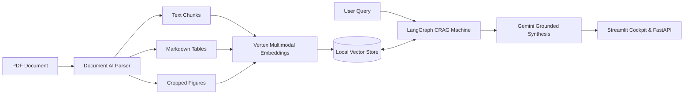

# Enterprise Corrective Multimodal RAGOps Platform (GCP)

An enterprise-grade multimodal document intelligence platform built on **Google Cloud Platform (GCP)** leveraging **Document AI Layout Parser**, **Vertex AI Multimodal Embeddings**, **LangGraph Corrective RAG (CRAG)**, **Gemini 1.5/2.0 Flash Grounding**, and **Ragas Multimodal Evaluations**.

---

## Key Features

- **Document AI Layout-Aware Ingestion**: Preserves document structure, extracts high-fidelity Markdown tables from multi-column grids, and crops charts/figures using normalized bounding polygons.
- **Unified Vertex Multimodal Embeddings**: Joint 1408-dimensional vector space mapping text blocks, Markdown tables, and cropped chart images via `multimodalembedding@001`.
- **LangGraph Corrective RAG (CRAG)**:
  - Multimodal Hybrid Retrieval across text and visuals.
  - LLM Grader Node for factual relevance filtering.
  - Ambiguity Rewriter Node for query reformulation.
  - External Fallback Search for missing internal context.
  - Grounded Synthesis with Gemini Flash and inline visual citations.
- **RAGOps CI/CD Benchmarking**: Automated evaluation harness using Ragas (Faithfulness, Relevance, Context Precision) with latency and cost tracking.
- **Scale-to-Zero Serverless Deployment**: Cloud Run service configured with `--min-instances 0` and local file-backed vector stores for **$0.00 idle burn**, adhering strictly to the $300 GCP credit limit.

---

## System Architecture



---

## Project Structure

```
.
├── config/                  # Pydantic Settings & GCP YAML configs
│   ├── settings.py
│   ├── logging_config.py
│   └── gcp_config.yaml
├── src/
│   ├── ingestion/           # Document AI parsing, table & chart extraction
│   ├── vector_store/        # Vertex embeddings & local vector store
│   ├── crag/                # LangGraph CRAG nodes, edges, and state machine
│   │   └── nodes/           # Retriever, Grader, Rewriter, Fallback, Generator
│   ├── evals/               # Ragas evaluations & latency tracing
│   ├── api/                 # FastAPI REST application
│   └── ui/                  # Streamlit multimodal dashboard
├── tests/
│   ├── unit/                # Fast, isolated unit tests
│   └── integration/         # CRAG pipeline & Ragas integration tests
├── scripts/                 # Bootstrap & Cost-Guard shutdown scripts
├── data/                    # Local storage (raw, processed, vector_index)
├── Dockerfile               # Multi-stage container for Cloud Run
├── docker-compose.yml       # Local development composition
├── Makefile                 # Automation targets
├── IMPLEMENTATION_PLAN.md   # Master state tracker & roadmap
└── README.md
```

---

## Zero-Idle-Burn Cost Rules ($300 Budget Ceiling)

1. **Development Vector Search**: All active development uses the file-backed local vector store (NumPy cosine / ScaNN). **Never deploy Vertex AI Vector Search Index Endpoints**, which incur continuous hourly node charges ($150-$300+/month).
2. **Cloud Run Serverless Compute**: Deployments must specify `--min-instances 0`. Containers scale to 0 when idle.
3. **Session Shutdown Verification**: Always execute `scripts/cost_guard.ps1` (or `.sh`) before closing a development session.

---

## Quickstart & Execution Guide

### 1. Clone & Install
```bash
git clone https://github.com/CapMorningStar/multimodal-ragops-platform.git
cd multimodal-ragops-platform
pip install -r requirements.txt
```

### 2. Configure Credentials
Copy the `.env.example` template:
```powershell
cp .env.example .env
# Edit .env with your GCP_PROJECT_ID and service_account.json path
```

### 3. Launch Services

#### Option A: Running Locally (FastAPI + Streamlit Cockpit)

In **Terminal 1** (FastAPI Backend):
```powershell
python -m uvicorn src.api.app:app --host 127.0.0.1 --port 8000
```
*Health Check: `http://127.0.0.1:8000/v1/health`*  
*Swagger Documentation: `http://127.0.0.1:8000/docs`*

In **Terminal 2** (Streamlit Multimodal UI):
```powershell
streamlit run src/ui/app.py --server.port 8501
```
*Cockpit UI: `http://localhost:8501`*

#### Option B: Launching via Docker Compose
```powershell
docker-compose up --build
```

### 4. Run Automated Evaluation & Cost Guard
```powershell
# Run full 39-test suite (100% pass rate)
pytest tests/ -v

# Run Ragas CI/CD benchmark runner
python -m src.evals.benchmark_runner --output eval_report.md

# Run zero-idle-burn cost audit
python scripts/cost_guard.py
```

---

## Master Implementation Plan
For step-by-step progress, architecture decisions, and live verification logs, review [IMPLEMENTATION_PLAN.md](IMPLEMENTATION_PLAN.md).
